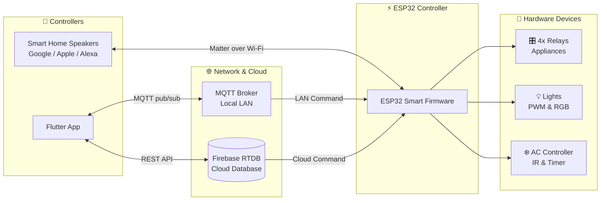

# 🏠 ESP32 Smart Home IoT Firmware

[](https://github.com/abod8639/smart_home_IoT_idf/actions)
[](https://codecov.io/gh/abod8639/smart_home_IoT_idf)
[](https://platformio.org/)
[](https://docs.espressif.com/projects/esp-idf/en/latest/)
[](https://isocpp.org/)
[](https://mqtt.org/)
[](https://buildwithmatter.com/)
[](https://www.freertos.org/)
[](https://firebase.google.com/)

> **Firmware Version:** `2.0.0` &nbsp;|&nbsp; **Device:** ESP32 DOIT DevKit V1 &nbsp;|&nbsp; **Framework:** ESP-IDF v5.5.4 + FreeRTOS

---

## 📖 Overview

**ESP32 Smart Home IoT Firmware** is a production-grade, multi-protocol smart home controller built for the ESP32 microcontroller. It bridges local LAN control via **MQTT**, cloud synchronization via **Firebase Realtime Database**, and native smart home ecosystem integration via the **Matter/CHIP** protocol — all running concurrently on FreeRTOS. The firmware controls an array of hardware peripherals including GPIO relay switches, PWM-driven lamps and RGB lights, an IR transceiver for AC unit control, and a dedicated AC timer manager. A dual-redundancy communication model ensures device controllability even when the primary MQTT broker is unreachable, seamlessly falling back to Firebase. The project is built and flashed with PlatformIO and exposes the device on the local network via mDNS at `smarthome.local`.

---

## ✨ Key Features

- **Dual-Protocol Communication** — Primary control via MQTT (LAN, port 1883); automatic fallback to Firebase RTDB (cloud REST API) when the broker is unavailable.
- **Matter / CHIP Integration** — Native Matter protocol support, enabling control from Google Home, Apple Home, and Amazon Alexa without a proprietary hub.
- **Persistent Matter Endpoints** — Up to 8 Matter endpoints stored in NVS flash; endpoints are reloaded before `esp_matter::start()` so the Commissioner always sees the full device list after a reboot.
- **GPIO Relay Control** — 4 independent relay channels (GPIO 2, 18, 19, 21) for switching mains-powered appliances.
- **PWM Dimmer & RGB Control** — LEDC peripheral drives a dimmable lamp (GPIO 22) and a full-colour RGB LED strip (GPIO 23/25/26), with 0–255 resolution.
- **IR Transceiver (RMT)** — Send and learn IR signals via GPIO 33 (TX) and GPIO 32 (RX), targeting AC units and other IR-controlled appliances.
- **AC Smart Timer** — Dedicated timer manager for scheduled AC on/off with target-temperature awareness.
- **Over-the-Air (OTA) Updates** — Secure HTTPS-only OTA firmware updates triggered via MQTT command.
- **NVS State Persistence** — Relay states, target temperature, Wi-Fi credentials, and Matter device configurations are persisted to NVS across reboots.
- **SNTP Time Synchronisation** — Automatic UTC clock sync on boot for accurate timestamped events and scheduling.
- **mDNS Discovery** — Device is discoverable on the local network at `smarthome.local` without knowing the IP address.
- **Task Watchdog** — 30-second hardware watchdog prevents firmware lockups; triggers a panic and reboot on timeout.
- **Command Dispatcher** — Clean, extensible command routing layer decouples protocol-specific transports (MQTT / Firebase) from hardware actions.
- **Flutter App Integration** — Designed to pair with a companion Flutter mobile app that reads/writes MQTT topics and Firebase paths.

---

## 🏗️ Architecture



---

## 🚀 Boot Sequence

The firmware performs a strictly ordered initialisation sequence to ensure each subsystem's dependencies are satisfied before it starts:

1. **Task Watchdog** — Registered with a 30-second timeout. Any task that blocks longer than 30 s triggers a panic and system reboot.
2. **NVS Storage** — `nvs_flash_init()` is called first; this is the backing store for Wi-Fi credentials, relay states, target temperature, and all Matter endpoint data.
3. **GPIO Relay Init** — All four relay GPIOs are configured as outputs and restored to their last known state from NVS.
4. **PWM (LEDC) Init** — LEDC peripheral is configured for the PWM lamp and RGB channels.
5. **IR Manager Init** — RMT peripheral is initialised for IR TX (GPIO 33) and IR RX (GPIO 32).
6. **AC Timer Manager Init** — AC countdown timer task is started and linked to the IR manager.
7. **Button Manager Init** — Physical button(s) configured for manual override and reset.
8. **WiFi Manager Init** — Connects to the configured AP using credentials from NVS (or `wifi_credentials.h`). Sets `WIFI_CONNECTED_BIT` in the global event group on success.
9. **MQTT Manager Init** — Connects to the broker defined in `mqtt_credentials.h`. Subscribes to the command topic immediately after connection.
10. **Matter Manager Init** — Loads saved endpoints from NVS → registers all endpoints with the Matter stack → calls `esp_matter::start()` → sets `MATTER_READY_BIT` (BIT1) in `g_wifi_event_group` after a 500 ms stabilisation delay.
11. **Firebase Manager Init** — Spawns `firebase_poll_task` (priority 5, stack 8192 bytes). The task blocks until both `WIFI_CONNECTED_BIT` **and** `MATTER_READY_BIT` are set (up to 30 s timeout) before reading the Matter QR payload from Firebase.
12. **mDNS Manager Init** — Registers the device as `smarthome.local` on the local network.
13. **SNTP Manager Init** — Starts NTP synchronisation to get the current UTC time.

---

## 📡 MQTT Topics

All topics are rooted at `smarthome/esp32_smart_home_1/`.

| Topic | Direction | QoS | Retained | Description |
|---|---|---|---|---|
| `smarthome/esp32_smart_home_1/cmd` | **Subscribe** | 0 | No | Inbound control commands (JSON payload) |
| `smarthome/esp32_smart_home_1/state` | **Publish** | 1 | ✅ Yes | Full device state snapshot (published on request or state change) |
| `smarthome/esp32_smart_home_1/event` | **Publish** | 1 | No | Delta events — individual pin or sensor changes |
| `smarthome/esp32_smart_home_1/sensor` | **Publish** | 1 | No | Sensor readings (temperature, humidity when DHT22 enabled) |
| `smarthome/esp32_smart_home_1/status` | **Publish (LWT)** | 1 | ✅ Yes | `"online"` on connect, `"offline"` as Last Will & Testament |

### Example Command Payload

```json
{
  "action": "set_relay",
  "pin": 2,
  "value": 1
}
```

---

## 🔥 Firebase RTDB Structure

```
Firebase RTDB Root
└── devices/
│   └── esp32_smart_home_1/
│       ├── status                    "online" | "offline"
│       ├── commands/                 ← Flutter app writes; ESP32 polls every 3 s
│       │   ├── action                e.g. "set_relay"
│       │   ├── pin                   target GPIO pin
│       │   └── value                 command payload value
│       ├── pins/
│       │   ├── relay_1               0 | 1  (GPIO 2)
│       │   ├── relay_2               0 | 1  (GPIO 18)
│       │   ├── relay_3               0 | 1  (GPIO 19 / AC)
│       │   ├── relay_4               0 | 1  (GPIO 21)
│       │   ├── pwm_lamp              0–255  (GPIO 22)
│       │   ├── pwm_rgb_r             0–255  (GPIO 23)
│       │   ├── pwm_rgb_g             0–255  (GPIO 25)
│       │   └── pwm_rgb_b             0–255  (GPIO 26)
│       ├── target_temperature        int (16–30 °C)
│       ├── ac_timer_remaining        int (seconds remaining)
│       ├── ir_signal/
│       │   ├── protocol              e.g. "NEC", "SAMSUNG"
│       │   ├── last_value            hex string
│       │   └── timestamp             Unix epoch (ms)
│       └── matter_payload/
│           ├── qr_code               Matter QR payload string
│           └── manual_code           11-digit manual pairing code
└── app_data/
    ├── rooms/                        Room definitions from Flutter app
    ├── devices/                      Virtual device registry
    └── ir_codes/                     Learned/stored IR code library
```

> **Polling interval:** `firebase_poll_task` reads the `commands/` node every **3 seconds** and dispatches received actions through the same `command_dispatcher` as MQTT commands, ensuring consistent behaviour across both transports.

---

## ⚙️ Supported Commands

Commands are dispatched via `command_dispatcher` regardless of whether they arrive from MQTT or Firebase.

| `action` | Required Parameters | Optional Parameters | Description |
|---|---|---|---|
| `set_relay` | `pin` (2/18/19/21), `value` (0 or 1) | — | Toggle a relay on or off |
| `set_pwm` | `pin` (22/23/25/26), `value` (0–255) | — | Set PWM duty cycle (brightness) |
| `control_ac` | `isOn` (bool), `target_temp` (16–30) | — | Send AC power / temperature IR command |
| `set_ac_timer` | `seconds` (int), `ir_code` (string) | — | Schedule AC off after N seconds |
| `ir_send` / `send_ir` | `protocol`, `value`, `bits` | `freq` (kHz, default 38) | Transmit a raw IR code |
| `ir_learn` | — | — | Put IR RX into learning mode for the next received code |
| `ota_start` | `url` (HTTPS only) | — | Initiate OTA firmware update from given URL |
| `add_device` | `type` (Matter device type), `pin` | — | Dynamically provision a new Matter endpoint and persist to NVS |
| `get_state` | — | — | Force publish of full device state to `state` topic / Firebase |

> **Security note:** `ota_start` enforces HTTPS. HTTP URLs are rejected to prevent MITM firmware injection.

---

## 🔌 GPIO Pinout

| GPIO | Function | Direction | Notes |
|---|---|---|---|
| **2** | Relay 1 | Output | Matter Endpoint 1 |
| **18** | Relay 2 | Output | Matter Endpoint 2 |
| **19** | Relay 3 — AC Unit | Output | Matter Endpoint 3 |
| **21** | Relay 4 | Output | Matter Endpoint 4 |
| **22** | PWM Lamp (LEDC) | Output | Matter Endpoint 5, 0–255 duty |
| **23** | PWM RGB — Red | Output | Matter Endpoint 6 |
| **25** | PWM RGB — Green | Output | Matter Endpoint 6 |
| **26** | PWM RGB — Blue | Output | Matter Endpoint 6 |
| **33** | IR Transmitter (RMT TX) | Output | NEC, Samsung, etc. |
| **32** | IR Receiver (RMT RX) | Input | IR learning mode |
| **4** | DHT22 Temperature/Humidity | Input | ⚠️ Currently disabled (commented out) |

---

## 🧩 Matter Integration

### Overview

The firmware implements the **Matter (formerly CHIP)** smart home protocol, enabling direct integration with Google Home, Apple Home, and Amazon Alexa without a proprietary cloud service.

### `MATTER_READY_BIT` Synchronisation

A dedicated event bit — **`MATTER_READY_BIT` (BIT1)** — is defined on `g_wifi_event_group`. This bit is **set 500 ms after `esp_matter::start()` returns successfully**, giving the Matter stack time to fully initialise its internal state machine before other tasks attempt to use it.

The `firebase_poll_task` **blocks on this bit** (alongside `WIFI_CONNECTED_BIT`) for up to 30 seconds before reading the Matter QR code payload from Firebase RTDB. This prevents a race condition where Firebase would be read before the QR / manual code was generated by the Matter stack.

```
firebase_poll_task:
  xEventGroupWaitBits(g_wifi_event_group,
                      WIFI_CONNECTED_BIT | MATTER_READY_BIT,
                      pdFALSE, pdTRUE,
                      pdMS_TO_TICKS(30000));  // 30 s timeout
  → then reads matter_payload/qr_code from Firebase
```

### NVS Endpoint Persistence

Matter endpoints are persisted to NVS under the `pins_state` namespace using the following key scheme:

| NVS Key | Type | Content |
|---|---|---|
| `mt_cnt` | `uint8_t` | Number of saved Matter endpoints (max 8) |
| `mt0_t` | `uint8_t` | Endpoint 0 — device type |
| `mt0_p` | `uint8_t` | Endpoint 0 — GPIO pin |
| `mt{n}_t` | `uint8_t` | Endpoint N — device type |
| `mt{n}_p` | `uint8_t` | Endpoint N — GPIO pin |

### Endpoint Load Order (Critical)

Endpoints are loaded from NVS and registered with the Matter stack **before** `esp_matter::start()` is called. This guarantees that a Matter Commissioner (e.g., the Google Home app) always sees the full set of previously paired devices when the ESP32 reboots — preventing the Commissioner from seeing a partial or empty device list.

```
Matter Manager init order:
  1. Read mt_cnt from NVS
  2. For each saved endpoint → esp_matter::endpoint::create(...)
  3. esp_matter::start()               ← Commissioner now sees all N endpoints
  4. vTaskDelay(500ms)
  5. xEventGroupSetBits(MATTER_READY_BIT)
```

### Matter Endpoint Mapping

| Matter Endpoint | GPIO Pin | Device Type |
|---|---|---|
| 1 | GPIO 2 | On/Off Switch (Relay 1) |
| 2 | GPIO 18 | On/Off Switch (Relay 2) |
| 3 | GPIO 19 | On/Off Switch (Relay 3 — AC) |
| 4 | GPIO 21 | On/Off Switch (Relay 4) |
| 5 | GPIO 22 | Dimmable Light (PWM Lamp) |
| 6 | GPIO 23/25/26 | Color Light (RGB) |

### Stub Mode

When compiled without the `esp-matter` component (e.g., for CI or testing), a stub implementation sets `MATTER_READY_BIT` **immediately**, allowing the rest of the boot sequence to proceed without hanging.

---

## 💾 NVS Persistence

All persistent state is stored in the **`pins_state`** NVS namespace.

| NVS Key | Type | Description |
|---|---|---|
| `p{pin}` | `uint8_t` | Relay state for GPIO `{pin}` (e.g., `p2`, `p18`, `p19`, `p21`) |
| `target_temp` | `int32_t` | Last set AC target temperature (°C) |
| `wifi_ssid` | `string` | Wi-Fi network SSID |
| `wifi_pass` | `string` | Wi-Fi network password |
| `mt_cnt` | `uint8_t` | Number of persisted Matter endpoints |
| `mt{n}_t` | `uint8_t` | Matter endpoint N — device type ID |
| `mt{n}_p` | `uint8_t` | Matter endpoint N — GPIO pin |

> On first boot (or after NVS erase), all keys default to safe values (relays off, temperature 24 °C, endpoint count 0).

---

## 🔧 Configuration

Before building, you must create the following credential/configuration header files. **These files are excluded from version control** (listed in `.gitignore`).

### `src/wifi_credentials.h`

```c
#pragma once

#define WIFI_SSID     "your_wifi_ssid"
#define WIFI_PASS     "your_wifi_password"
```

### `src/mqtt_credentials.h`

```c
#pragma once

#define MQTT_BROKER_URI    "mqtt://192.168.1.100:1883"  // or HiveMQ cloud URI
#define MQTT_USERNAME      "your_mqtt_username"
#define MQTT_PASSWORD      "your_mqtt_password"

// Topics
#define MQTT_TOPIC_CMD     "smarthome/esp32_smart_home_1/cmd"
#define MQTT_TOPIC_STATE   "smarthome/esp32_smart_home_1/state"
#define MQTT_TOPIC_EVENT   "smarthome/esp32_smart_home_1/event"
#define MQTT_TOPIC_SENSOR  "smarthome/esp32_smart_home_1/sensor"
#define MQTT_TOPIC_STATUS  "smarthome/esp32_smart_home_1/status"
```

### `src/firebase_manager.h` (credential section)

```c
#pragma once

#define FIREBASE_BASE_URL    "https://your-project-default-rtdb.firebaseio.com"
#define FIREBASE_AUTH_SECRET "your_firebase_database_secret"
```

### `src/device_config.h`

```c
#pragma once

#define DEVICE_ID           "esp32_smart_home_1"
#define FIRMWARE_VERSION    "2.0.0"

// GPIO Pin Definitions
#define PIN_RELAY_1         2
#define PIN_RELAY_2         18
#define PIN_RELAY_3_AC      19
#define PIN_RELAY_4         21
#define PIN_PWM_LAMP        22
#define PIN_RGB_RED         23
#define PIN_RGB_GREEN       25
#define PIN_RGB_BLUE        26
#define PIN_IR_TX           33
#define PIN_IR_RX           32
// #define PIN_DHT22        4   // Disabled — uncomment to enable
```

---

## 🛠️ Build & Flash

### Prerequisites

- [PlatformIO Core](https://docs.platformio.org/en/latest/core/installation/index.html) (CLI or IDE extension)
- ESP-IDF toolchain (automatically managed by PlatformIO)
- USB connection to the ESP32 DOIT DevKit V1

### Steps

```bash
# 1. Clone the repository
git clone https://github.com/abod8639/smart_home_IoT_idf.git
cd smart_home_IoT_idf

# 2. Create the required credential header files (see Configuration section above)
#    src/wifi_credentials.h
#    src/mqtt_credentials.h
#    src/firebase_manager.h  (credential definitions)
#    src/device_config.h

# 3. Build the firmware
pio run

# 4. Flash to the connected ESP32
pio run --target upload

# 5. Monitor serial output (115200 baud)
pio device monitor --baud 115200

# 6. (Optional) Erase NVS before first flash
pio run --target erase
```

### OTA Update (after initial flash)

Send the following command to the MQTT `cmd` topic to trigger an OTA update:

```json
{
  "action": "ota_start",
  "url": "https://your-server.com/firmware/smart_home_v2_1_0.bin"
}
```

> ⚠️ The `url` **must** use HTTPS. HTTP URLs are rejected by the firmware.

### PlatformIO Environment (`platformio.ini`)

```ini
[env:esp32doit-devkit-v1]
platform  = espressif32
board     = esp32doit-devkit-v1
framework = espidf
monitor_speed = 115200
```

---

## 📝 Notes

- **DHT22 sensor** (GPIO 4) is currently commented out in the codebase. To re-enable temperature/humidity readings, uncomment the relevant code in `device_config.h` and the sensor task.
- **Matter commissioning** requires the device to be on the same Wi-Fi network as the commissioner app (Google Home, etc.) during initial setup. The QR code and 11-digit manual pairing code are written to Firebase RTDB at `devices/esp32_smart_home_1/matter_payload/` for retrieval by the Flutter companion app.
- **Factory reset** can be performed by erasing NVS flash with `pio run --target erase`, which clears all saved credentials, relay states, and Matter endpoint bindings.
- The **Task Watchdog** (30 s) is intentional and should not be disabled in production. Ensure that all FreeRTOS tasks call `esp_task_wdt_reset()` (or yield) within the watchdog window.
- This firmware is designed to pair with the **[Smart Home Flutter App](https://github.com/abod8639/smart_home)** for full mobile control.

---

<div align="center">

Made with ❤️ using ESP-IDF, FreeRTOS, and Matter &nbsp;|&nbsp; © 2024–2026 [abod8639](https://github.com/abod8639)

</div>
