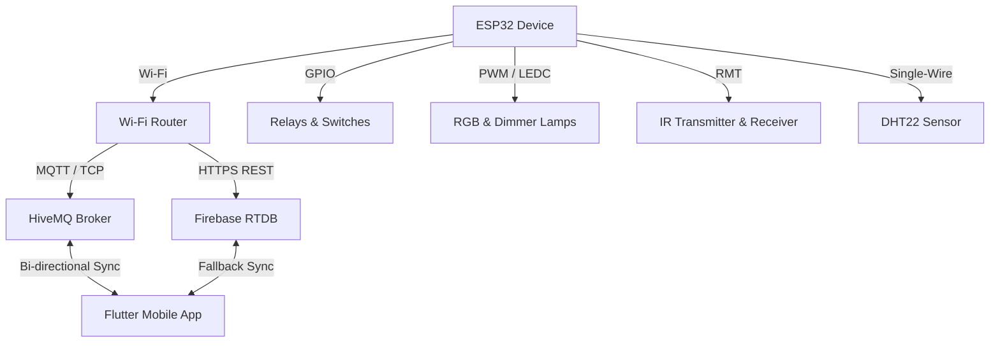

# نظام المنزل الذكي القائم على ESP32 و ESP-IDF 🏠🤖 (Smart Home IoT Firmware)

نظام متكامل لتشغيل وإدارة أجهزة المنزل الذكي مبني باستخدام بيئة التطوير الرسمية **ESP-IDF v5.5.4** لجهاز **ESP32**. يتيح هذا النظام التحكم في الإضاءة، المفاتيح الكهربائية (Relays)، أجهزة الأشعة تحت الحمراء (IR)، وقراءة مستشعرات الحرارة والرطوبة مع دعم بروتوكولات اتصال متعددة تضمن الاستجابة الفورية والموثوقية العالية.

---

## 🚀 الميزات الرئيسية (Key Features)
- **المفاتيح الرقمية (GPIO Relays):** دعم التحكم في 4 مفاتيح كهربائية منفصلة لتشغيل وإيقاف الأجهزة المختلفة مع حفظ حالتها تلقائياً عند انقطاع الطاقة.
- **التحكم بالتردد النبضي (PWM & RGB):** التحكم بمستوى سطوع مصباح عادي (Dimmer) ومزج الألوان لشريط إضاءة RGB.
- **مرسل ومستقبل الأشعة تحت الحمراء (IR RMT):** تعلم وإرسال إشارات الـ IR للتحكم في المكيفات، التلفزيونات، والأجهزة الأخرى باستخدام طرفي الإرسال والاستقبال.
- **قراءة المناخ (DHT22):** مراقبة درجة الحرارة والرطوبة بشكل دوري وبدقة عالية.
- **الاتصال المزدوج والموثوق (Dual-Protocol Sync):**
  - **MQTT:** البروتوكول الأساسي للتحكم والمزامنة الفورية ثنائية الاتجاه مع التطبيق.
  - **Firebase RTDB:** قاعدة بيانات احتياطية متزامنة بالكامل في حال تعطل أو عدم توفر سيرفر الـ MQTT.
- **التكامل مع معيار Matter:** بنية برمجية تدعم معيار Matter لضمان التوافق مع أنظمة Apple Home و Google Home و Alexa.
- **الذاكرة غير المتطايرة (NVS):** حفظ حالات الأجهزة وإعدادات الشبكة بشكل دائم لضمان استرجاع الحالة بعد إعادة التشغيل.
- **التحديث اللاسلكي (OTA):** دعم تحديث البرامج الثابتة للجهاز عن بعد وبشكل آمن.

---

## 🛠️ التقنيات والبروتوكولات المستخدمة (Tech Stack)

### 1. نظام التشغيل والمنصة
- **ESP-IDF (v5.5.4):** الإطار الرسمي لتطوير التطبيقات من Espressif القائم على FreeRTOS لإدارة المهام المتعددة (Multithreading).
- **PlatformIO:** بيئة البناء وإدارة المكتبات.

### 2. بروتوكولات الاتصال (Network Protocols)
- **MQTT:** يعمل كعميل يتصل بموزع (Broker) مثل HiveMQ عبر المنفذ `1883` لتبادل الرسائل والأوامر بصيغة JSON.
- **HTTP REST (Firebase Realtime Database):** يُستخدم للمزامنة الاحتياطية وإرسال تحديثات الحالة بشكل دوري وقراءة الأوامر في حال عدم توفر اتصال MQTT.
- **Matter (Project Chip):** معيار الاتصال الموحد للمنازل الذكية المدمج في نظام ESP-IDF.

### 3. التحكم بالعتاد والطرفيات (Hardware Peripherals)
- **RMT (Remote Control Peripheral):** لإنشاء وتوليد نبضات إشارات الأشعة تحت الحمراء (IR) بدقة متناهية.
- **LEDC (LED Control):** لتوليد إشارات PWM للتحكم في خفض سطوع الإضاءة وألوان الـ RGB.
- **GPIO / NVS:** لإدخال/إخراج الإشارات الرقمية وحفظ البيانات بشكل مستمر.

---

## 📋 مخطط وهيكل النظام (System Architecture)



---

## 📡 قنوات ورسائل الـ MQTT (MQTT Topics Schema)

يعتمد الجهاز على معرّف فريد للـ (Device ID) وهو `esp32_smart_home_1`. يتم تبادل الرسائل بصيغة JSON عبر القنوات التالية:

| القناة (Topic) | النوع | الوصف / محتوى الرسالة |
| :--- | :---: | :--- |
| `smarthome/esp32_smart_home_1/cmd` | استقبال (Sub) | استقبال الأوامر من التطبيق للتحكم بالعتاد (مثل تشغيل ريليه أو تغيير إضاءة). |
| `smarthome/esp32_smart_home_1/state` | إرسال (Pub) | إرسال الحالة الكاملة للجهاز عند التشغيل أو عند طلب مزامنة الحالة. |
| `smarthome/esp32_smart_home_1/event` | إرسال (Pub) | إرسال حدث منفرد عند تغير حالة أي مفتاح أو إضاءة بشكل فوري. |
| `smarthome/esp32_smart_home_1/sensor` | إرسال (Pub) | بث قراءات مستشعر الحرارة والرطوبة دورياً: `{"temperature": 24.5, "humidity": 60.2}`. |
| `smarthome/esp32_smart_home_1/status` | إرسال (Pub) | قناة الوصية الأخيرة (LWT) لتحديد حالة الجهاز: `online` عند الاتصال، و `offline` عند انقطاع الاتصال. |

---

## 🔌 خريطة توصيل المنافذ (GPIO Pinout Map)

تم ربط الطرفيات بالمنافذ التالية على لوحة الـ ESP32:

| الطرفية / الجهاز | منفذ الـ GPIO | الوصف |
| :--- | :---: | :--- |
| **Relay 1** | `2` | المفتاح الكهربائي الأول (شاشة/مروحة) |
| **Relay 2** | `18` | المفتاح الكهربائي الثاني |
| **Relay 3** | `19` | المفتاح الكهربائي الثالث |
| **Relay 4** | `21` | المفتاح الكهربائي الرابع |
| **PWM Lamp** | `22` | مصباح الإضاءة القابل للتعتيم |
| **RGB Red** | `23` | قناة اللون الأحمر لشريط الـ RGB |
| **RGB Green** | `25` | قناة اللون الأخضر لشريط الـ RGB |
| **RGB Blue** | `26` | قناة اللون الأزرق لشريط الـ RGB |
| **IR Transmitter (TX)** | `33` | مرسل الأشعة تحت الحمراء |
| **IR Receiver (RX)** | `32` | مستقبل الأشعة تحت الحمراء (لتعلم الإشارات) |
| **DHT22 Sensor** | `4` | مستشعر درجة الحرارة والرطوبة |

---

## 💻 طريقة التشغيل والبناء (Installation & Build)

### المتطلبات الأساسية:
1. تثبيت برنامج **VS Code** مع إضافة **PlatformIO IDE**.
2. توفر حزمة **ESP-IDF v5.5.4** أو ما يتوافق معها.

### الخطوات المتبعة:
1. **تهيئة ملفات الاعتماد السرية (Credentials):**
   قم بإنشاء ملف باسم `wifi_credentials.h` داخل مجلد `src/` لوضع إعدادات شبكة الـ Wi-Fi الخاصة بك:
   ```c
   #define WIFI_SSID "اسم_شبكتك"
   #define WIFI_PASS "كلمة_المرور"
   ```

2. **تهيئة ملف إعدادات الـ MQTT:**
   قم بإنشاء ملف باسم `mqtt_credentials.h` داخل مجلد `src/` لوضع رابط السيرفر:
   ```c
   #define MQTT_BROKER_URL "mqtt://broker.hivemq.com"
   ```

3. **بناء المشروع ورفعه:**
   - افتح المشروع بواسطة PlatformIO.
   - قم بعمل **Build** للتأكد من خلو المشروع من الأخطاء وتثبيت التبعيات.
   - قم بتوصيل لوحة ESP32 بمنفذ الـ USB ثم اختر **Upload**.
   - لمراقبة المخرجات ومعرفة حالة الاتصال، افتح الـ **Serial Monitor** بمعدل باود `115200`.

---

## 💡 ملاحظة
تم تطوير هذا المشروع لأغراض التعلم والتجربة الشخصية لتطوير أنظمة إنترنت الأشياء (IoT) المتكاملة والموثوقة.
