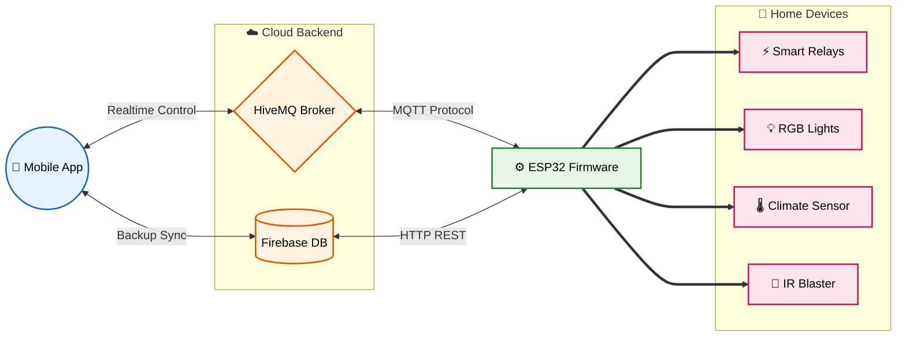

# ESP32 Smart Home IoT Firmware

A comprehensive smart home device firmware built using the official Espressif IoT Development Framework (ESP-IDF v5.5.4) for the ESP32 platform. This system facilitates real-time control of GPIO relays, PWM-based dimmer and RGB lighting, Infrared (IR) learn/transmit capabilities, and DHT22 climate sensor monitoring. It incorporates multi-protocol synchronization for high responsiveness and robust fault tolerance.

---

## Key Features

- **GPIO Relay Control:** Support for 4 independent digital switches (relays) to power appliances on/off, with automatic state persistence to Non-Volatile Storage (NVS).
- **Dimming and RGB Control (PWM):** Fine-grained brightness control for a single-channel dimmer lamp and color mixing for RGB light strips using LEDC peripherals.
- **Infrared Learning and Transmission (IR RMT):** Learn, decode, and transmit IR signals to control air conditioners, televisions, and other media appliances using RMT peripherals.
- **Climate Monitoring (DHT22):** Periodic, high-precision reads for ambient temperature and relative humidity.
- **Dual-Protocol Synchronization:**
  - **MQTT:** Primary communication channel for low-latency, bi-directional control and state publishing.
  - **Firebase Realtime Database (RTDB):** Primary cloud database backup that remains synchronized via HTTP REST APIs to act as a fallback control pathway.
- **Matter Standard Integration:** Designed with software abstractions compatible with the Matter smart home standard for future interoperability with systems like Apple Home, Google Home, and Amazon Alexa.
- **Non-Volatile Storage (NVS):** Stores configuration settings, Wi-Fi credentials, and appliance states to restore operation immediately after power resets.
- **Over-the-Air Updates (OTA):** Integrated framework to securely update firmware over the network.

---

## Technical Stack and Protocols

### 1. Operating System and Platform
- **ESP-IDF v5.5.4:** The official development framework from Espressif, leveraging FreeRTOS for preemptive multitasking and event-driven task scheduling.
- **PlatformIO:** Used for building, flashing, and package dependency management.

### 2. Network Protocols
- **MQTT:** Connects to an external broker (such as HiveMQ) over port 1883. Utilizes JSON-formatted payloads for command and telemetry exchanges.
- **HTTP/HTTPS REST:** Connects to Firebase RTDB for fallback control commands, device health checks, and state logging.
- **Matter (Project Chip):** Standardized application layer for cross-ecosystem smart home controller integration.

### 3. Hardware Peripheral Controllers
- **RMT (Remote Control):** Utilized for capturing raw carrier waveforms and transmitting structured infrared sequences with microsecond precision.
- **LEDC (LED Control):** High-speed PWM hardware driver for smooth color fades and precise duty cycle light dimming.
- **GPIO / NVS:** Standard input/output control and flash partition memory management.

---

## System Architecture




---

## MQTT Topics Schema

The firmware registers under the unique client identifier `esp32_smart_home_1`. Telemetry, state changes, and remote commands flow through the following topic structure:

| Topic | Type | Description / Payload Format |
| :--- | :---: | :--- |
| `smarthome/esp32_smart_home_1/cmd` | Subscribe | Inbound commands from the controller/app to modify hardware states. |
| `smarthome/esp32_smart_home_1/state` | Publish | Full device state broadcasted at boot-up or on-demand to sync state. |
| `smarthome/esp32_smart_home_1/event` | Publish | Delta updates sent immediately when any relay or lamp state changes. |
| `smarthome/esp32_smart_home_1/sensor` | Publish | Periodic climate telemetry: `{"temperature": 24.5, "humidity": 60.2}`. |
| `smarthome/esp32_smart_home_1/status` | Publish | Last Will and Testament (LWT) indicating connection health: `online` or `offline`. |

---

## GPIO Pinout Mapping

Hardware components are mapped to the physical ESP32 development board pins as follows:

| Component / Device | GPIO Pin | Description |
| :--- | :---: | :--- |
| **Relay 1** | `2` | Primary digital switch (e.g., fan/display) |
| **Relay 2** | `18` | Secondary digital switch |
| **Relay 3** | `19` | Tertiary digital switch |
| **Relay 4** | `21` | Quaternary digital switch |
| **PWM Lamp** | `22` | Single-channel dimmer light |
| **RGB Red** | `23` | RGB Light strip red channel |
| **RGB Green** | `25` | RGB Light strip green channel |
| **RGB Blue** | `26` | RGB Light strip blue channel |
| **IR Transmitter (TX)** | `33` | Infrared transmitter diode |
| **IR Receiver (RX)** | `32` | Infrared demodulator sensor (demodulator receiver) |
| **DHT22 Sensor** | `4` | Temperature and humidity sensor bus |

---

## Build and Installation Guide

### Prerequisites
1. Install **VS Code** with the **PlatformIO IDE** extension.
2. Ensure you have the **ESP-IDF v5.5.4** toolchain.

### Configuration
1. **Network Credentials:**
   Create a header file named `wifi_credentials.h` inside the `src/` directory to configure your Wi-Fi credentials:
   ```c
   #define WIFI_SSID "YOUR_WIFI_SSID"
   #define WIFI_PASS "YOUR_WIFI_PASSWORD"
   ```

2. **MQTT Broker Configurations:**
   Create a header file named `mqtt_credentials.h` inside the `src/` directory to define the target host:
   ```c
   #define MQTT_BROKER_URL "mqtt://broker.hivemq.com"
   ```

### Execution
1. Open the project folder in PlatformIO.
2. Run the **Build** task to download dependencies and compile the sources.
3. Connect the ESP32 board to your computer via USB.
4. Execute the **Upload** task to flash the firmware.
5. Open the **Serial Monitor** at a baud rate of `115200` to review debug logs and connection status.

---

## Note
This project is developed for educational and personal experimentation purposes in building scalable, reliable, and multi-protocol IoT systems.
